## 密码学第二次大作业

###### 计71 张程远 2017011429

### 实验结果

##### **1.1 AES128**

**（1）正确性**

以下是一组测试，输入明文为两组chengyua17201701，由于我没有实现padding，而cyberchef用了pcks7padding（填了16个0x10），因此我们只需要关注前两组结果就可以了。密钥和IV都是16个'a'。

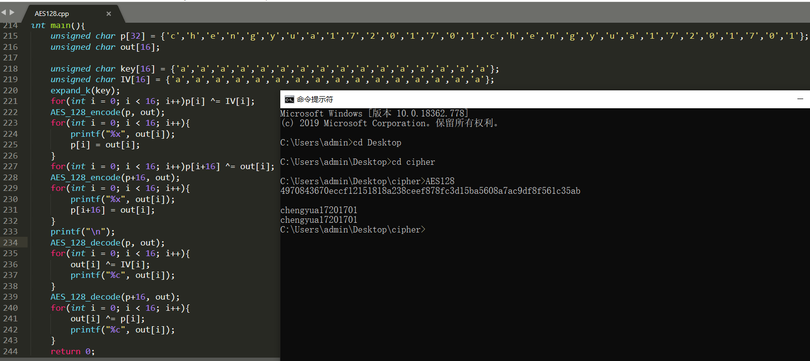

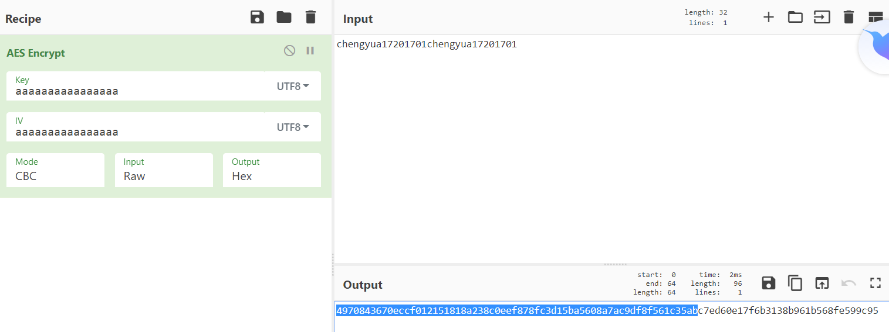

**（2）实现速度**

如下所示，实验要求加密一段16Kbits的数据（2048个字节），那我让这段代码执行6400次，从而得到加密100Mbits数据所需要的时间。最后也没有达到100Mbps的要求，完成100Mb的加密大约需要9秒，也就是11Mbps的速度。

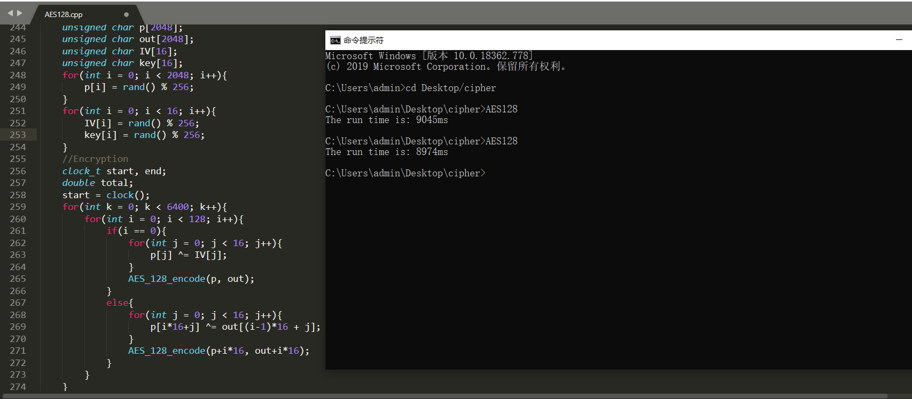

##### 1.2 DES

**（1）正确性**

以下是一组测试，输入密文为chengyua17201701，由于没有实现padding，因此只关注前两组结果。密钥为abcdefgh，IV为8个a。

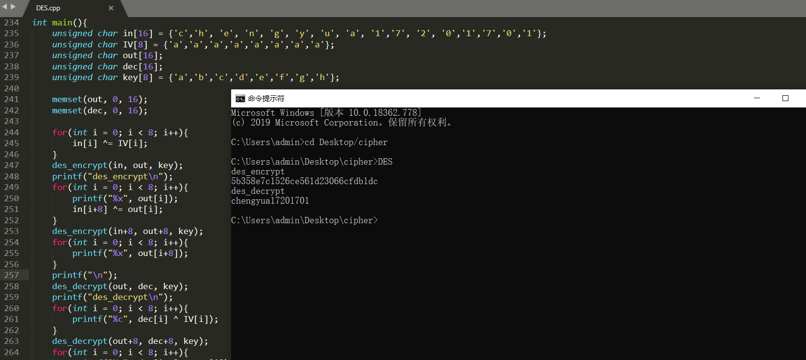

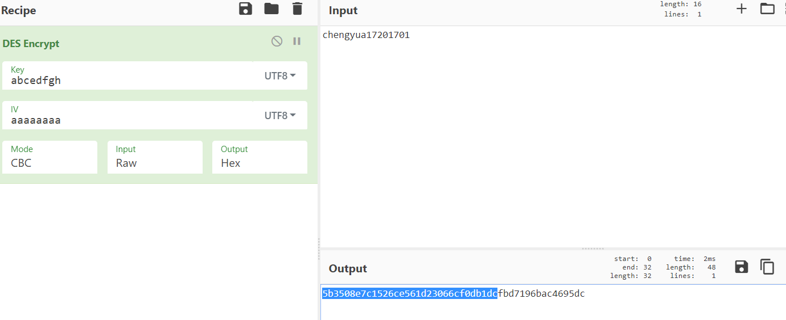

**（2）实现速度**

没有达到100Mbps，最后实现到大概30-40Mbps，也就是100Mbit的数据需要2.6秒左右，如下图所示。

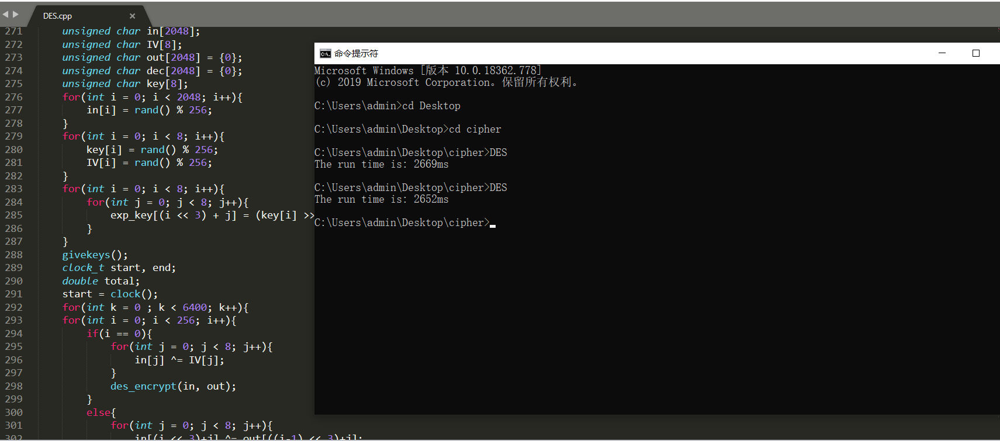

##### 1.3 SM4

（1）正确性

参照国家标准GB/T 32907-2016实现，对文后两个测试样例进行测试，结果与文档中所给结果一致，中间变量也完全一致。文档地址（需要Flash）：

```
http://c.gb688.cn/bzgk/gb/showGb?type=online&hcno=7803DE42D3BC5E80B0C3E5D8E873D56A
```

运行结果如下所示。

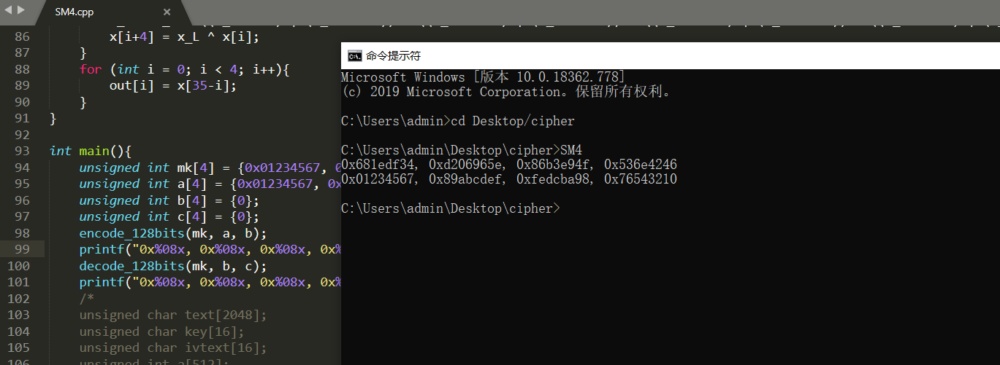

**（2）实现速度**

SM4的实现比较快，因为对于机器而言，32位字和8位的字节都是一样的，比如一条异或指令，无论是对char还是word，都是一条指令xor。SM4厉害的地方在于它的操作单位是word，这样一条指令能够处理32位的数据，大大提升了效率。运行截图如下，加密一段16Kbits的数据（2048个字节），让这段代码执行6400次，得到的执行时间是0.3s，能够达到要求。

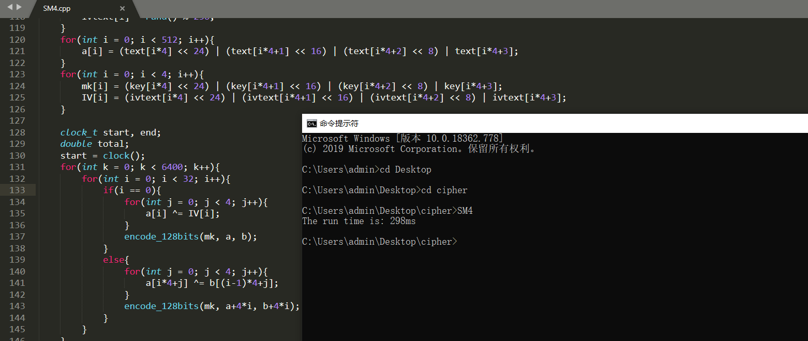

**2.1 RC4**

**（1）正确性**

一组测试如下所示。

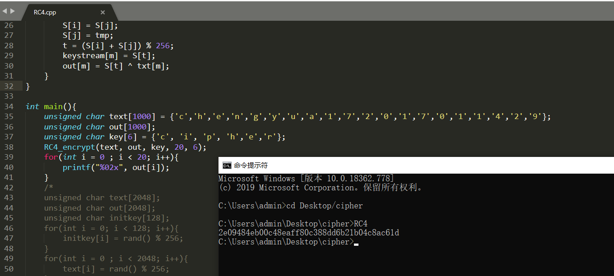

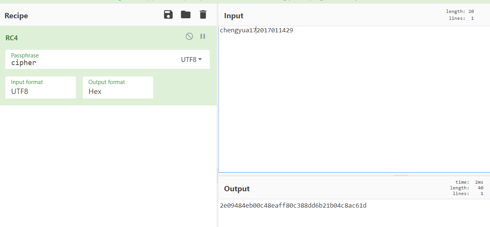

**（2）实现速度**

RC4的实现还是比较快，随机生成16Kbits的数据，对其进行6400次加密，耗时130ms，达到速率要求。如下图所示。

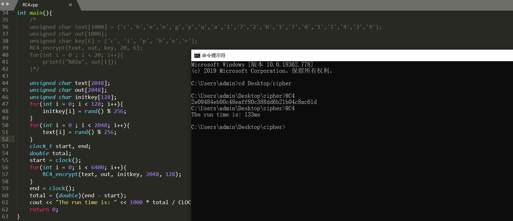

##### 2.2 B-M

**（1）正确性**

找了3组测例进行测试，程序给出了正确的结果。（实际上课堂小测也是它算的，与手算结果一致）

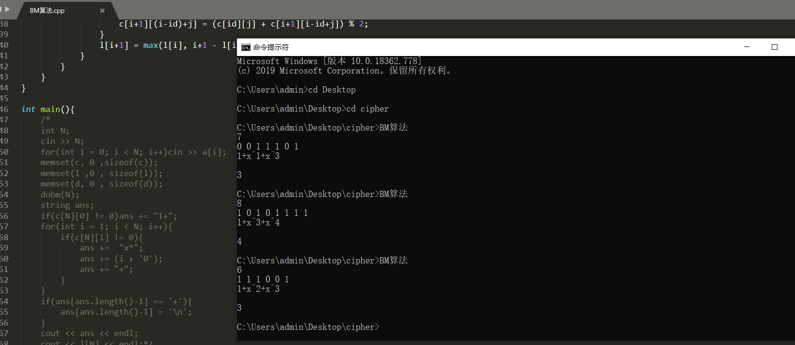

**（2）实现速度**

这里我还是采用之前的方法，把10bits的处理程序执行了100000次，执行时间为70ms。当然，由于这是个N方算法，直接执行1000000bits的输入肯定比上面这种执行慢得多。好在其他算法复杂度都接近线性，因此测试比较准确。

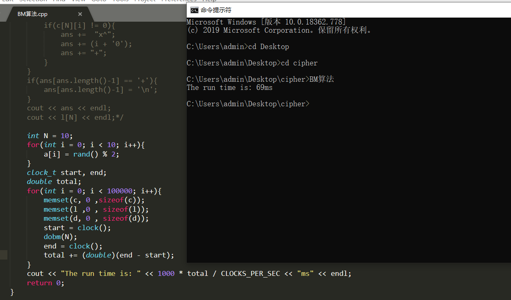

##### 3.1 SHA2-256

##### （1）正确性

一组测试如下所示。

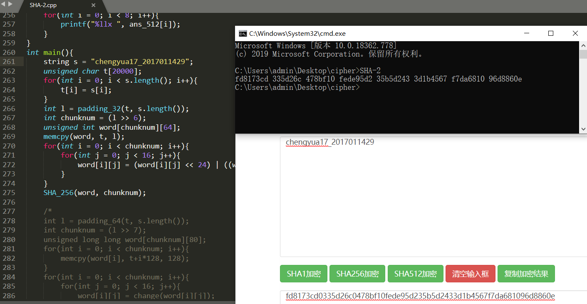

##### （2）实现速度

如代码实现，随机生成16Kbit的数据（2048个char），对其进行6400次加密，加密耗时约200-300ms，达到速率要求。如下图所示。

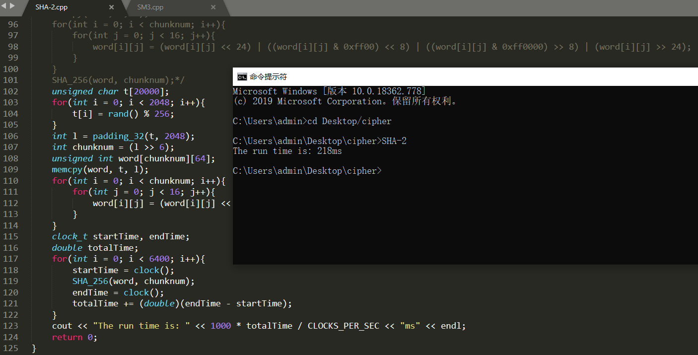

##### 3.2 SM3

**（1）正确性**

测试了SM3国密原始文档中的两个输入数据，杂凑值和中间变量值与说明文档中给出的结果完全一致，故我认为实现正确。下图是512比特的样例，由16个abcd组成，及测试结果。

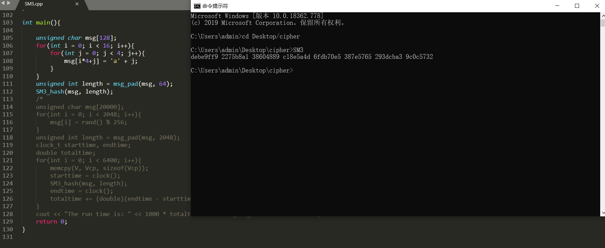

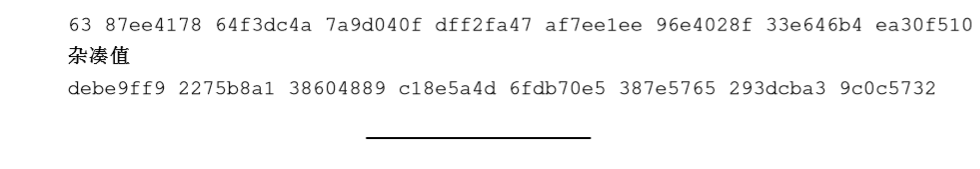

**（2）实现速度**

如代码实现，随机生成16Kbit的数据（2048个char），对其进行6400次加密，加密耗时约300-400ms，达到速率要求。如下图所示。

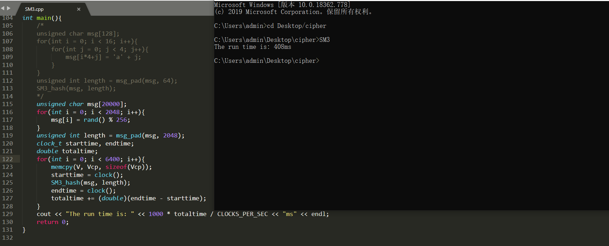

#### 3.3 SHA3-256

##### （1）正确性

一组测试如下所示。

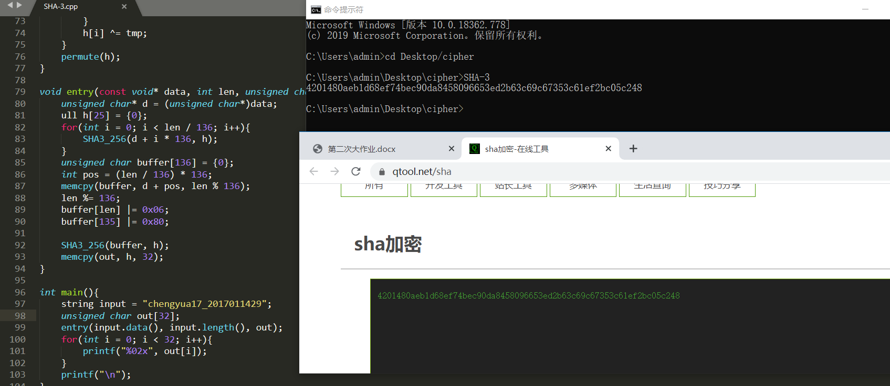

##### （2）实现速度

如代码实现，随机生成16Kbit的数据（2048个char），对其进行6400次加密，加密耗时约400-500ms，达到速率要求。如下图所示。

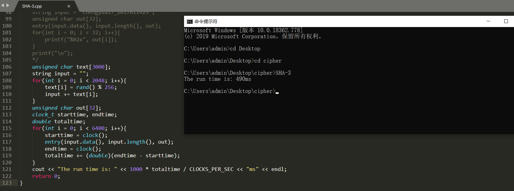

### 优化

CPU是Intel i7-6700HQ，2.60GHz。

关于加密程序的效率，主要考虑到两点，第一是少用STL模板和string，能够减少常数开销，因此我在代码中使用的单位都是unsigned char，操作也基本是对数组指针做操作。这样能够大大提升程序的执行效率。第二是一些卡常技巧，比如能用位运算的地方尽量考虑用位运算，减少循环赋值而改用memcpy函数等。在编译上，我在部分程序的代码中指定了编译器优化，并给不含递归的程序添加了inline。

从整体效果来看，程序执行的速率尚可，但AES和DES与100Mbps的目标还相距甚远。

### 输入与密钥值

文件中给出了一组16Kbit的input，它是程序运行前2048次rand() % 256得到的结果，以16进制的方式输入到文件中。output_XX和decrypt_XX分别是算法对input加密，和对加密得到的结果进行解密，所得到的输出。输出应该与input完全一致，且output已在cyberchef网站上验证，完全正确。以下是各个算法所用的key值和IV值，所有文件都是以16进制的形式给出。

AES128

IV：de556cf7bb3dc177f14cbc59581bc00f	 Key：27e0eb6b74366c610b0b8d68e413aaa6

DES

IV：27e0eb6b74366c61	Key：de556cf7bb3dc177

SM4

IV：27e0eb6b74366c610b0b8d68e413aaa6	Key：de556cf7bb3dc177f14cbc59581bc00f

RC4

Key：de2755e06cebf76bbb743d36c16c7761f10b4c0bbc8d596858e41b13c0aa0fa6fc591789a2be20079dab02a72deda7b92f7d702f9ffbd4ae5b574be529d26a1efc254f1273ff3f02a3b58e031635bf9a133ded8820ca6ae7c6d2a5769435513267f2c326e8969c8355fba9f3852e072b26b18bbf4ae3603b22bcf26f08bd0b0a

关于BM算法，运行时需要输入参数，第一个参数一行，为比特串长度N，然后第二行输入比特串，每个01之间用空格隔开，然后获得LFSR和l的值。
